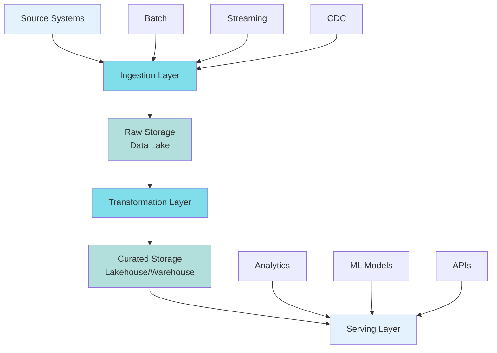
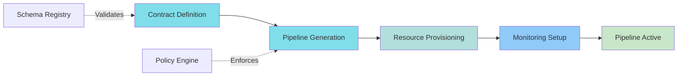
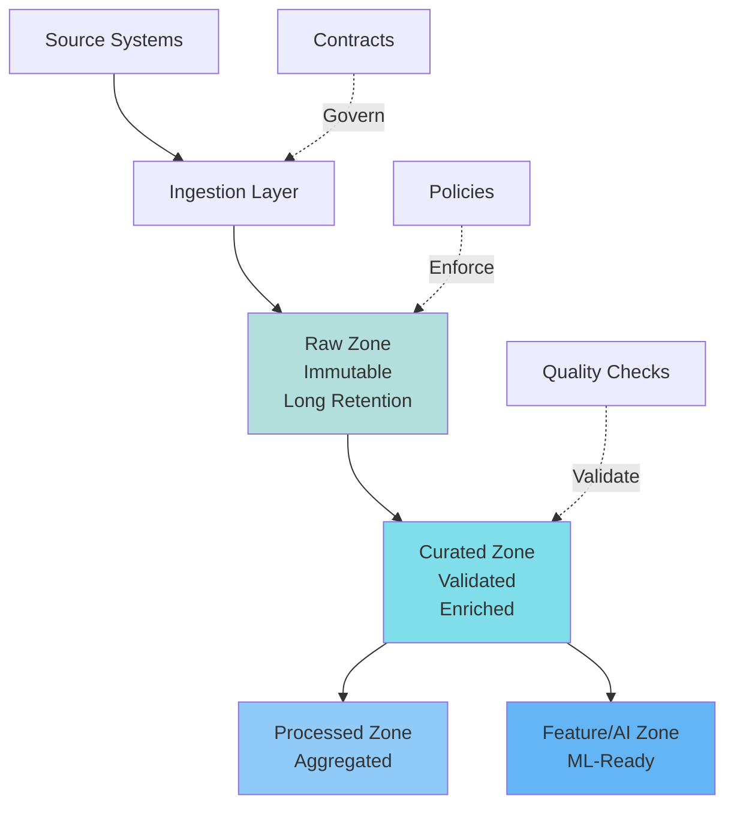

# Ingestion Architecture

> How ingestion fits into your overall data architecture.

## Overview

Ingestion architecture defines how data flows from source systems into your platform. It's the foundation that everything else builds on.

## Architecture Layers



**Complete data flow from source systems to consumption.**

## Ingestion Patterns

### Pattern 1: Batch Ingestion

**Architecture:**
```
Source → Scheduled Job → Raw Storage (Parquet)
```

**Characteristics:**
- Scheduled execution (hourly, daily)
- Full or incremental extracts
- Higher latency (minutes to hours)
- Lower cost per GB

**Use when:**
- Historical loads
- Large volumes
- No real-time requirement

### Pattern 2: Streaming Ingestion

**Architecture:**
```
Source → Message Queue (Kafka) → Stream Processor → Raw Storage
```

**Characteristics:**
- Continuous processing
- Low latency (seconds to minutes)
- Higher cost per GB (3-5x batch)
- More complex failure handling

**Use when:**
- Real-time requirements
- Event-driven architecture
- Low-latency use cases

### Pattern 3: Change Data Capture (CDC)

**Architecture:**
```
Database → Transaction Log → CDC Tool → Message Queue → Storage
```

**Characteristics:**
- Captures inserts, updates, deletes
- Maintains transaction consistency
- Lower overhead than full extracts
- Real-time or near real-time

**Use when:**
- Database replication
- Maintaining current state
- Audit trails

## Storage Architecture

### Raw Layer Design

**Purpose:** Preserve source data exactly as received

**Design principles:**
- **Immutable** - Never modify raw data (append-only)
- **Schema-on-read** - Store in flexible formats
- **Partitioned** - By ingestion time, source
- **Long retention** - 7 years for compliance

**Format:** Parquet (analytics), Avro (streaming), JSON (flexible)

**Example structure:**
```
raw/
  source=web_events/
    date=2024-01-15/
      hour=10/
        data.parquet
```

### Curated Layer Design

**Purpose:** Cleaned, validated, enriched data

**Design principles:**
- **Schema-on-write** - Enforced schemas
- **Partitioned** - By business keys
- **Optimized** - For query patterns
- **Versioned** - Track changes over time

**Format:** Delta Lake, Iceberg, Parquet

**Example structure:**
```
curated/
  events/
    date=2024-01-15/
      data.delta
```

## Scalability Patterns

### Horizontal Scaling

**Multiple ingestion workers:**
- Partition sources across workers
- Each worker handles subset of sources
- Scale workers based on load

### Vertical Scaling

**Larger instances:**
- More CPU/memory per worker
- Handle larger sources
- Better for single large sources

### Hybrid Approach

**Combine both:**
- Horizontal for many small sources
- Vertical for large sources

## Error Handling

### Retry Strategy

**Exponential backoff:**
```python
max_retries = 5
base_delay = 1  # seconds

for attempt in range(max_retries):
    try:
        ingest(record)
        break
    except TransientError:
        if attempt < max_retries - 1:
            delay = base_delay * (2 ** attempt)
            sleep(delay)
        else:
            send_to_dlq(record)  # Dead letter queue
```

### Dead Letter Queue (DLQ)

**Purpose:** Store records that failed after all retries

**Implementation:**
- Separate storage (S3, BigQuery table)
- Alert on DLQ size
- Manual review and reprocessing

## Monitoring

### Key Metrics

**Volume:**
- Records/second
- GB/day
- Partition count

**Latency:**
- End-to-end latency
- Processing time per record
- Queue depth

**Quality:**
- Schema validation failures
- Duplicate rate
- Missing data rate

**Reliability:**
- Success rate
- Error rate by type
- DLQ size

## Cost Optimization

### Common Cost Traps

1. **Over-ingestion** - Ingesting unused data
2. **Inefficient formats** - JSON instead of Parquet
3. **Redundant ingestion** - Multiple pipelines for same source
4. **Streaming when batch would suffice** - 3-5x cost premium

### Optimization Techniques

1. **Compression** - Use Snappy or Zstd (2-5x reduction)
2. **Partitioning** - Only process new partitions
3. **Incremental loads** - Only fetch changed data
4. **Lifecycle policies** - Move old data to cheaper storage

## Agentic Controls & Data Zones in Ingestion Architecture

### Self-Serve Contracts

**Architecture pattern:**

Ingestion platforms evolve to support contract-first, self-serve pipeline creation:



**Implementation:**
- Contract stored in schema registry
- Pipeline templates for common patterns
- Automated resource provisioning
- Standard monitoring and alerting

**Impact:**
- Time to value: Hours instead of weeks
- Consistency: Standard patterns enforced
- Quality: Contracts prevent issues

### Autonomous Error Detection

**Architecture pattern:**

Ingestion systems detect and respond to errors autonomously:

**Error detection:**
- Real-time monitoring of pipeline health
- Pattern recognition for common failures
- Anomaly detection for unusual behavior

**Autonomous response:**
- Automatic retry with backoff
- Root cause analysis
- Preventive actions
- Escalation when needed

**Example flow:**
```
Error Detected
    ↓
Pattern Matching (network timeout)
    ↓
Automatic Retry (exponential backoff)
    ↓
Success → Continue
Failure → Escalate
```

### Policy-Gated Control Planes

**Architecture pattern:**

Ingestion control planes enforce policies automatically:

**Policy types:**
- **Schema policies** - Enforce contract compliance
- **Cost policies** - Prevent cost overruns
- **Quality policies** - Enforce quality standards
- **Security policies** - Access control, encryption

**Enforcement:**
- Policies defined as code
- Automatic validation at ingestion boundary
- Rejection of non-compliant data
- Alerting on policy violations

### Data Zones in Ingestion Flows

**Zone-based ingestion architecture:**



**Zone characteristics:**

**Raw Zone ingestion:**
- Minimal transformation
- Schema-on-read
- Long retention
- Immutable storage

**Curated Zone ingestion:**
- Quality validation
- Schema enforcement
- Enrichment
- Optimized formats

**Impact on pipeline design:**
- Clear boundaries between zones
- Zone-specific transformation logic
- Zone-appropriate storage formats
- Zone-specific lifecycle policies

### Impact on Observability

**Zone-aware observability:**

- **Raw Zone**: Ingestion metrics, schema validation, volume
- **Curated Zone**: Quality scores, freshness, completeness
- **Processed Zone**: Query performance, usage patterns
- **Feature Zone**: Serving latency, feature freshness

**Lineage tracking:**
- Zone-to-zone data flow
- Transformation lineage
- Ownership tracking
- Impact analysis

### Impact on Lineage

**Zone-based lineage:**

```
Source → Raw Zone → Curated Zone → Processed Zone
                          ↓
                    Feature Zone
```

**Benefits:**
- Clear data flow visualization
- Zone-specific impact analysis
- Ownership clarity
- Compliance documentation

## Related Topics

- **[Data Ingestion](../data-ingestion/index.md)** - Ingestion patterns
- **[Storage](storage.md)** - Storage design
- **[Data Processing](../data-processing/index.md)** - Processing ingested data
- **[Platform Strategy](../platform-strategy-and-future-direction.md)** - Strategic direction

---

**Next**: [Data Orchestration →](../data-orchestration/index.md)

