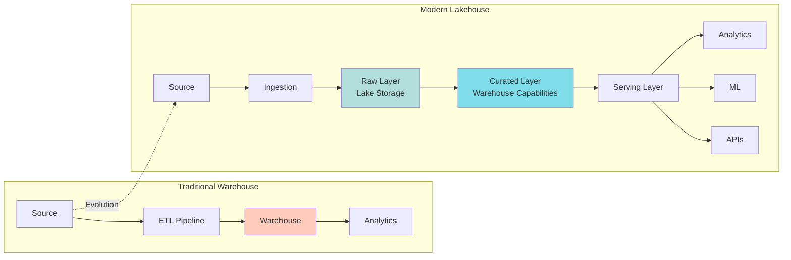

# Lakehouse Architecture

> Combining the flexibility of data lakes with the performance of data warehouses.

## Overview

The **Lakehouse** is a modern data architecture that combines the cost-effective storage of data lakes with the performance and capabilities of data warehouses. It provides a single source of truth for all data types while maintaining both flexibility and performance.

## What is a Lakehouse?

**Lakehouse** = Data lake storage + warehouse capabilities



**Shift from monolithic warehouses to modern lakehouse architectures.**

### Key Characteristics

- **Open formats** - Parquet, Delta, Iceberg (not proprietary)
- **ACID transactions** - Reliable updates, deletes
- **Schema enforcement** - Data quality at write time
- **Time travel** - Query historical versions
- **Upserts** - Update existing records efficiently

## Benefits

### 1. Cost Efficiency

- **Storage**: Object storage (S3, GCS) is 10x cheaper than warehouse storage
- **Compute**: Pay only for queries, not idle time
- **Lifecycle**: Move old data to cheaper tiers automatically

### 2. Flexibility

- **Multiple engines**: Query with Spark, Presto, BigQuery, Snowflake
- **Multiple formats**: Support structured, semi-structured, unstructured
- **Schema evolution**: Handle changing schemas gracefully

### 3. Performance

- **Columnar formats**: Parquet, Delta for fast analytics
- **Partitioning**: Query pruning for efficiency
- **Indexing**: Fast lookups when needed

### 4. Single Source of Truth

- **No duplication**: One copy of data, multiple access patterns
- **Consistency**: Same data for all consumers
- **Lineage**: Clear data flow

## Lakehouse Formats

### Delta Lake

**Best for:** ACID transactions, time travel, upserts

**Pros:**
- ✅ ACID transactions
- ✅ Time travel (query historical versions)
- ✅ Upserts, deletes
- ✅ Schema evolution
- ✅ Metadata optimization

**Cons:**
- ❌ Requires compatible engines
- ❌ More complex than Parquet

**Use when:**
- Need updates/deletes
- Time travel required
- Concurrent writes

### Apache Iceberg

**Best for:** Open format, multi-engine support

**Pros:**
- ✅ Open format (not vendor-specific)
- ✅ Multi-engine support
- ✅ Good performance
- ✅ Partition evolution

**Cons:**
- ❌ Less mature than Delta
- ❌ Smaller ecosystem

**Use when:**
- Want open format
- Multi-engine requirements
- Avoiding vendor lock-in

### Apache Hudi

**Best for:** Real-time updates, incremental processing

**Pros:**
- ✅ Real-time updates
- ✅ Incremental processing
- ✅ Good for streaming

**Cons:**
- ❌ Less mature
- ❌ Smaller ecosystem

**Use when:**
- Real-time updates needed
- Streaming use cases

## Architecture Layers

### 1. Raw Layer (Bronze)

**Purpose:** Preserve source data exactly as received

**Characteristics:**
- Immutable (append-only)
- Schema-on-read
- Long retention (7 years)
- Partitioned by ingestion time

**Format:** Parquet, JSON, Avro

### 2. Curated Layer (Silver)

**Purpose:** Cleaned, validated, enriched data

**Characteristics:**
- Schema-on-write
- Quality checks applied
- Enriched with reference data
- Partitioned by business keys

**Format:** Delta Lake, Iceberg, Parquet

### 3. Serving Layer (Gold)

**Purpose:** Analysis-ready, aggregated data

**Characteristics:**
- Optimized for queries
- Pre-aggregated
- Denormalized
- Indexed

**Format:** Delta Lake, Iceberg, or warehouse tables

## Implementation

### Example: Delta Lake on S3

```python
# Write to Delta Lake
df.write.format("delta") \
    .mode("overwrite") \
    .option("mergeSchema", "true") \
    .partitionBy("date") \
    .save("s3://lakehouse/curated/events")

# Query with Spark
spark.read.format("delta") \
    .load("s3://lakehouse/curated/events") \
    .filter("date = '2024-01-15'") \
    .show()

# Upsert
from delta.tables import DeltaTable

deltaTable = DeltaTable.forPath(spark, "s3://lakehouse/curated/events")
deltaTable.alias("target").merge(
    updatesDF.alias("source"),
    "target.id = source.id"
).whenMatchedUpdateAll() \
.whenNotMatchedInsertAll() \
.execute()
```

### Example: Iceberg on GCS

```python
# Write to Iceberg
df.write.format("iceberg") \
    .mode("overwrite") \
    .option("write-format", "parquet") \
    .partitionBy("date") \
    .save("gs://lakehouse/curated/events")

# Query with Spark
spark.read.format("iceberg") \
    .load("gs://lakehouse/curated/events") \
    .filter("date = '2024-01-15'") \
    .show()
```

## Best Practices

### 1. Partitioning Strategy

**Time-based partitioning:**
```
events/
  date=2024-01-15/
    data.parquet
```

**Benefits:**
- Query pruning
- Lifecycle management
- Parallel processing

### 2. Schema Evolution

**Backward-compatible changes:**
- Add optional fields
- Make required fields optional
- Never remove fields (deprecate instead)

### 3. Lifecycle Management

**Automatically move old data:**
- Hot (0-30 days): Active queries
- Warm (30-90 days): Occasional queries
- Cold (90+ days): Archive, compliance

### 4. Metadata Management

**Track:**
- Schema versions
- Partition information
- Statistics (min/max values)
- Lineage

## Comparison: Lakehouse vs Alternatives

| Aspect | Data Lake | Data Warehouse | Lakehouse |
|-------|-----------|----------------|-----------|
| **Storage Cost** | Low | High | Low |
| **Query Performance** | Medium | High | High |
| **Schema Flexibility** | High | Low | Medium |
| **ACID Transactions** | No | Yes | Yes |
| **Time Travel** | No | Limited | Yes |
| **Multi-Engine** | Yes | No | Yes |

## When to Use Lakehouse

**Use Lakehouse when:**
- ✅ Need cost-effective storage
- ✅ Need fast queries
- ✅ Need schema flexibility
- ✅ Need ACID transactions
- ✅ Want to avoid vendor lock-in

**Don't use Lakehouse when:**
- ❌ Simple use case (warehouse is enough)
- ❌ No engineering resources (use managed warehouse)
- ❌ Small scale (warehouse is simpler)

## Related Topics

- **[Storage](storage.md)** - Storage fundamentals
- **[Data Ingestion](../data-ingestion/index.md)** - Getting data into lakehouse
- **[Data Processing](../data-processing/index.md)** - Processing lakehouse data

---

**Next**: [Ingestion Architecture →](ingestion-architecture.md)

