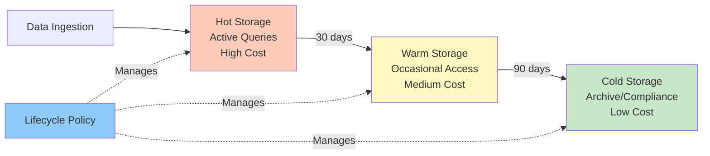

# Storage & Data Architecture

> "Most data outages are just bad communication bugs."

Storage is where data lives. Get the architecture right, and queries are fast, costs are low, and operations are smooth. Get it wrong, and you'll pay in performance, cost, and complexity.

> "Gen-Z doesn't hate complexity. They hate unclear systems."

## Data Lake vs Data Warehouse

### Data Lake

**Characteristics:**
- Schema-on-read (flexible schemas)
- File-based storage (S3, GCS, ADLS)
- Supports structured, semi-structured, unstructured data
- Lower storage cost
- Requires compute engine (Spark, Presto) for queries

**Best for:**
- Raw data storage
- Diverse data types (logs, images, documents)
- Cost-sensitive, large volumes
- ELT patterns (load first, transform later)

**Tools**: S3 + Spark, GCS + BigQuery, ADLS + Databricks

### Data Warehouse

**Characteristics:**
- Schema-on-write (enforced schemas)
- Table-based storage
- Optimized for SQL queries
- Higher storage cost
- Integrated compute

**Best for:**
- Curated, analysis-ready data
- SQL-heavy workloads
- Business intelligence, reporting
- Fast query performance

**Tools**: BigQuery, Snowflake, Redshift, Databricks SQL

### Modern Approach: Lakehouse

**Lakehouse** = Data lake storage + warehouse capabilities

**Architecture:**
```
Raw Layer (Lake) → Curated Layer (Warehouse) → Serving Layer
```

**Benefits:**
- Cost-effective storage (lake)
- Fast queries (warehouse)
- Single source of truth
- Flexible ingestion (lake) + optimized serving (warehouse)

**Implementation**: Delta Lake, Iceberg, Hudi on object storage

## Storage Tiers



**Automated lifecycle management moving data to cost-appropriate tiers.**

### Hot Storage

**Use case**: Active queries, dashboards, real-time analytics

**Characteristics:**
- SSD-backed
- Low latency (< 100ms)
- High cost ($0.023/GB/month for BigQuery)
- Frequent access

**Examples**: BigQuery active storage, Snowflake standard tier, S3 Standard

### Warm Storage

**Use case**: Ad-hoc analysis, occasional queries

**Characteristics:**
- Standard storage
- Moderate latency (< 1s)
- Medium cost ($0.01-0.02/GB/month)
- Infrequent access

**Examples**: BigQuery long-term storage, S3 Standard-IA, Snowflake transient

### Cold Storage

**Use case**: Compliance, historical data, archives

**Characteristics:**
- Object storage
- High latency (seconds to minutes)
- Low cost ($0.004/GB/month)
- Rare access

**Examples**: S3 Glacier, GCS Coldline, Azure Archive

### Lifecycle Policies

**Automatically move data between tiers:**

```python
# Example: S3 lifecycle policy
{
  "Rules": [
    {
      "Id": "Move to IA after 30 days",
      "Status": "Enabled",
      "Transitions": [
        {
          "Days": 30,
          "StorageClass": "STANDARD_IA"
        }
      ]
    },
    {
      "Id": "Move to Glacier after 90 days",
      "Status": "Enabled",
      "Transitions": [
        {
          "Days": 90,
          "StorageClass": "GLACIER"
        }
      ]
    }
  ]
}
```

**Expected savings**: 50-70% on storage costs.

## Partitioning Strategies

### Time-Based Partitioning

**Most common pattern:**

```
events/
  year=2024/
    month=01/
      day=15/
        hour=10/
          data.parquet
```

**Benefits:**
- Query pruning (only scan relevant partitions)
- Lifecycle management (delete old partitions)
- Parallel processing

**Partition granularity:**
- **Daily**: Most common, good for most use cases
- **Hourly**: High-volume, time-sensitive queries
- **Monthly**: Low-volume, historical data

### Key-Based Partitioning

**Use when queries filter on specific keys:**

```
users/
  user_id_hash=12345/
    data.parquet
```

**Hash partitioning:**
- Distributes data evenly
- Prevents hot partitions
- Good for high-cardinality keys

**Range partitioning:**
- Natural ordering (dates, IDs)
- Efficient range queries
- Risk of skew

### Multi-Level Partitioning

**Combine time + key:**

```
events/
  date=2024-01-15/
    user_id_hash=12345/
      data.parquet
```

**Trade-off**: More partitions = better pruning, but more metadata overhead.

## File Formats

### Parquet

**Best for**: Analytics, columnar queries, large datasets

**Pros:**
- Highly compressed (5-10x)
- Columnar (only read needed columns)
- Schema embedded
- Fast scans

**Cons:**
- Write overhead
- Less flexible than JSON
- Requires schema

**Use when**: Analytics workloads, large tables, cost-sensitive

### Avro

**Best for**: Streaming, schema evolution, row-based access

**Pros:**
- Compact binary format
- Schema evolution support
- Row-based (good for streaming)
- Schema embedded

**Cons:**
- Slower for analytics
- Less compression than Parquet

**Use when**: Streaming pipelines, Kafka, schema evolution needed

### Delta Lake / Iceberg

**Best for**: ACID transactions, time travel, upserts

**Pros:**
- ACID transactions
- Time travel (query historical versions)
- Upserts, deletes
- Schema evolution
- Metadata optimization

**Cons:**
- More complex than Parquet
- Requires compatible engines

**Use when**: Need updates/deletes, time travel, concurrent writes

### JSON

**Best for**: Flexible schemas, nested data, APIs

**Pros:**
- Human-readable
- No schema required
- Flexible

**Cons:**
- Large size (no compression)
- Slow queries
- No schema enforcement

**Use when**: Raw ingestion, flexible schemas, small volumes

**Recommendation**: Convert JSON to Parquet post-ingestion.

## CDC + Current State Patterns

### Problem

CDC streams capture changes (inserts, updates, deletes), but analytics often needs **current state** (latest value per key).

### Solution 1: Merge Pattern

**Merge CDC events into current state table:**

```sql
-- Upsert pattern
MERGE INTO current_state AS target
USING cdc_events AS source
ON target.id = source.id
WHEN MATCHED AND source.op = 'UPDATE' THEN
  UPDATE SET col1 = source.col1, updated_at = source.timestamp
WHEN MATCHED AND source.op = 'DELETE' THEN
  DELETE
WHEN NOT MATCHED AND source.op = 'INSERT' THEN
  INSERT (id, col1, updated_at) VALUES (source.id, source.col1, source.timestamp)
```

**Tools**: Spark, Flink, BigQuery MERGE

### Solution 2: Snapshot + Incremental

**Periodic snapshots + incremental updates:**

```sql
-- Daily snapshot
CREATE TABLE current_state_2024_01_15 AS
SELECT * FROM current_state_2024_01_14
UNION ALL
SELECT * FROM cdc_events
WHERE date = '2024-01-15'
```

**Pros**: Simple, easy to reprocess  
**Cons**: Storage overhead, slower queries

### Solution 3: Event Sourcing

**Store all events, compute current state on read:**

```sql
-- Current state = latest event per key
SELECT DISTINCT ON (id) *
FROM events
ORDER BY id, timestamp DESC
```

**Pros**: Full history, audit trail  
**Cons**: Expensive queries, complex logic

**Recommendation**: Use merge pattern for most cases. It's efficient and maintains current state.

## External Tables

### Concept

Query data in object storage (S3, GCS) without loading into warehouse.

**Architecture:**
```
S3/GCS (Parquet files) → External Table Definition → SQL Queries
```

**Benefits:**
- No data duplication
- Lower storage cost
- Direct query on lake
- Separation of storage and compute

**Trade-offs:**
- Slower than native tables
- Limited optimization
- Requires compatible formats

### Implementation

**BigQuery:**
```sql
CREATE EXTERNAL TABLE events
OPTIONS (
  format = 'PARQUET',
  uris = ['gs://bucket/events/*.parquet']
);
```

**Snowflake:**
```sql
CREATE EXTERNAL TABLE events
WITH LOCATION = @s3_stage/events/
FILE_FORMAT = (TYPE = PARQUET);
```

**Use when**: Raw data, infrequent queries, cost-sensitive

## Data Modeling Patterns

### Star Schema (Kimball)

**Structure:**
- **Fact tables**: Transactions, events (large, append-only)
- **Dimension tables**: Users, products, time (small, slowly changing)

**Example:**
```
fact_orders (order_id, user_id, product_id, date_id, amount)
dim_users (user_id, name, email, ...)
dim_products (product_id, name, category, ...)
dim_date (date_id, date, month, year, ...)
```

**Pros:**
- Simple, intuitive
- Fast queries (pre-joined)
- Standard BI tool support

**Cons:**
- Denormalization (storage overhead)
- Rigid structure

### Data Vault

**Structure:**
- **Hubs**: Business keys (users, products)
- **Links**: Relationships (user_orders)
- **Satellites**: Attributes (user_details, order_details)

**Pros:**
- Auditability (full history)
- Flexible (easy to add attributes)
- Scalable

**Cons:**
- Complex queries (many joins)
- Steeper learning curve

### One Big Table (OBT)

**Structure:**
- Single denormalized table
- All attributes in one place

**Pros:**
- Simple queries (no joins)
- Fast for specific use cases

**Cons:**
- High storage cost
- Update complexity
- Less flexible

**Recommendation**: Start with star schema. It's the most practical for analytics.

## Compression & Optimization

### Compression Algorithms

| Algorithm | Compression Ratio | Speed | Use Case |
|-----------|------------------|-------|----------|
| **Snappy** | 2-3x | Fast | Real-time, streaming |
| **Gzip** | 3-5x | Medium | General purpose |
| **Zstd** | 4-6x | Fast | Best balance |
| **LZ4** | 2-3x | Very fast | Low latency |
| **Brotli** | 5-7x | Slow | Archive, cold storage |

**Recommendation**: Use Zstd for most cases. Best compression/speed ratio.

### Columnar Optimization

**For Parquet files:**
- **Sort by**: Frequently filtered columns
- **Dictionary encoding**: Low-cardinality columns
- **Bloom filters**: Fast existence checks
- **Statistics**: Min/max for pruning

```python
df.write.parquet(
    path,
    partitionBy=['date'],
    sortBy=['user_id'],  # Sort within partitions
    compression='zstd'
)
```

## Retention & Archival

### Retention Policies

**Define by data type:**

| Data Type | Retention | Rationale |
|-----------|-----------|-----------|
| Raw events | 7 years | Compliance, reprocessing |
| Curated tables | 2 years | Business needs |
| Aggregations | 1 year | Historical trends |
| Logs | 90 days | Debugging, audit |

### Archival Strategy

1. **Identify candidates**: Low access, old data
2. **Compress**: Use high compression (Brotli)
3. **Move to cold storage**: Glacier, Coldline
4. **Update metadata**: Mark as archived
5. **Delete from hot storage**: After archival confirmed

**Automation**: Use lifecycle policies or scheduled jobs.

## Monitoring Storage

### Key Metrics

**Volume:**
- Total size (GB, TB)
- Growth rate (%/month)
- Partition count

**Cost:**
- Storage cost per GB
- Cost by tier (hot/warm/cold)
- Cost trends

**Performance:**
- Query scan size (GB)
- Partition pruning efficiency
- Cache hit rate

**Health:**
- Orphaned partitions
- Small file count (many small files = slow)
- Compression ratio

### Alerting

**Critical:**
- Storage cost spike > 20%
- Growth rate > 50%/month
- Partition count > 10,000 (may impact performance)

**Warning:**
- Small files detected (> 1000 files < 10MB)
- Compression ratio dropping
- Unused tables (no queries in 90 days)

## Next Steps

- [Platform & Operating Model](05-platform-operating-model.md) - How to organize your platform
- [Cost Efficiency & Scale](07-cost-efficiency.md) - Advanced optimization techniques

