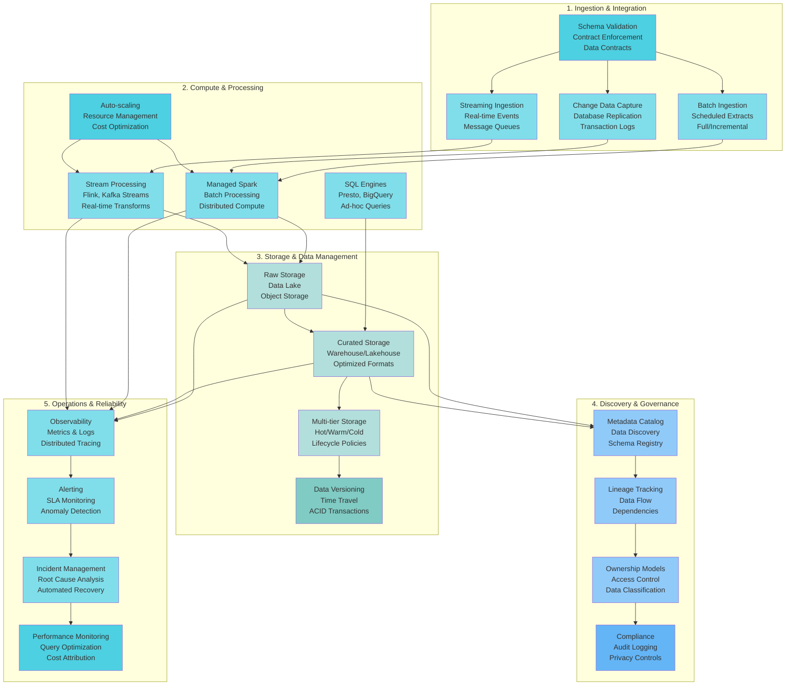

# Data Engineering

> The discipline of designing, building, and operating systems that transform raw data into reliable, accessible, and actionable information at scale.

**नमस्ते!** (Namaste - Welcome in India 🇮🇳)

## Overview

Data Engineering sits at the intersection of infrastructure, reliability, and data product delivery. Unlike data science (which focuses on analysis) or software engineering (which focuses on application logic), data engineering is about **building platforms** that enable teams to work with data at scale.

## Core Concepts

### What is Data Engineering?

Modern data engineering is about:

1. **Reliability** - Ensuring data arrives on time, in the right format, with the right quality
2. **Scale** - Handling terabytes to petabytes of data across thousands of pipelines
3. **Velocity** - Supporting both batch and real-time use cases
4. **Governance** - Maintaining lineage, quality, and compliance
5. **Cost Efficiency** - Delivering value without breaking the bank

### The Shift: From ETL to Platform

!!! tip "Platform Thinking"
    Traditional data engineering focused on **ETL pipelines**—point-to-point data movement. Modern data engineering is about **platforms**—self-serve infrastructure that enables teams.

### Platform Capabilities

**Production-grade platform capabilities organized by functional area with clear component segregation.**

A mature data platform provides integrated capabilities across the data lifecycle:

**Ingestion & Integration** — Standardized patterns for batch, streaming, and CDC ingestion with schema validation and contract enforcement

**Compute & Processing** — Managed compute environments (Spark, Flink, Dataflow) with auto-scaling and standardized transformation frameworks

**Storage & Data Management** — Multi-tier storage abstractions with automated lifecycle policies, partitioning, and data versioning

**Discovery & Governance** — Centralized metadata catalog with lineage tracking, ownership models, and access control

**Operations & Reliability** — End-to-end observability, automated alerting, incident management, and SLA compliance tracking

## Key Topics

### [Foundations](foundations.md)
Modern definition of Data Engineering, core principles, and platform thinking.

**Learn about:**
- Data as a Product
- Separation of Concerns
- Platform Thinking
- Cost Awareness
- Contract-First Design

### [Lifecycle](lifecycle.md)
Complete data journey: ingestion → transformation → storage → serving.

**Learn about:**
- Ingestion patterns (batch, streaming, CDC)
- Storage layers (raw, curated, archive)
- Transformation strategies (ELT vs ETL)
- Serving patterns (analytics, ML, operational)

### [Platform & Operating Model](platform-operating-model.md)
How to structure your platform organization and processes.

**Learn about:**
- Central vs Domain Ownership
- Paved Paths and Escape Hatches
- Contract-First Ingestion
- Cost Attribution
- Self-Serve Capabilities

### [Cost Efficiency](cost-efficiency.md)
Practical strategies to reduce costs by 20-40% without sacrificing quality.

**Learn about:**
- Common cost traps
- Optimization strategies
- Streaming vs micro-batch
- Zombie pipeline detection

## Principles

This playbook is built on these core principles:

- **📦 Data as a Product** - Treat data assets as first-class products
- **🔀 Separation of Concerns** - Clear boundaries between layers
- **🚀 Platform Thinking** - Build self-serve capabilities
- **💰 Cost Awareness** - Every decision considers cost
- **💡 Opinionated Guidance** - Clear recommendations, not generic explanations

## Quick Start

!!! success "New to Data Engineering?"
    Start with **[Foundations](foundations.md)** to understand core concepts and principles.

!!! tip "Building a Platform?"
    Read **[Platform & Operating Model](platform-operating-model.md)** first to design your operating model.

!!! warning "Optimizing Costs?"
    Jump to **[Cost Efficiency](cost-efficiency.md)** for practical optimization strategies.

## Related Topics

- **[Data Ingestion](../data-ingestion/index.md)** - Getting data into your platform
- **[Data Architecture](../data-architecture/index.md)** - Storage and data organization
- **[Data Quality](../data-quality/index.md)** - Ensuring data reliability

---

**Next**: [Foundations →](foundations.md)

