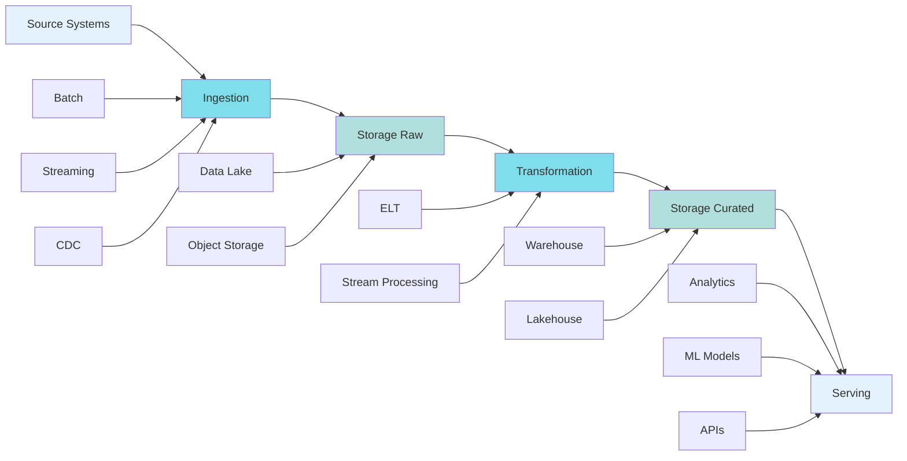

# End-to-End Lifecycle

> "Data freshness is just trust, measured in minutes."

The data lifecycle encompasses the complete journey from source systems to consumption. Understanding this flow is critical for designing scalable, maintainable data platforms.

> "Every broken pipeline started as 'we'll clean it later.'"

## Overview



**End-to-end lifecycle from ingestion to trusted consumption.**

Each stage has distinct requirements, failure modes, and optimization opportunities.

## Stage 1: Ingestion

**Goal**: Get data from source systems into the platform reliably and efficiently.

### Ingestion Patterns

#### Batch Ingestion
- **When**: Historical loads, daily/hourly snapshots, large volumes
- **Tools**: Airflow, Spark, Dataflow (batch mode)
- **Characteristics**: 
  - Scheduled execution
  - Full or incremental loads
  - Higher latency (minutes to hours)
  - Lower cost per GB

#### Streaming Ingestion
- **When**: Real-time analytics, event-driven systems, low-latency requirements
- **Tools**: Kafka, Pub/Sub, Kinesis, Flink, Dataflow (streaming)
- **Characteristics**:
  - Continuous processing
  - Low latency (seconds to minutes)
  - Higher cost per GB
  - More complex failure handling

#### Change Data Capture (CDC)
- **When**: Database replication, maintaining current state, audit trails
- **Tools**: Debezium, Datastream, DMS, Fivetran
- **Characteristics**:
  - Captures inserts, updates, deletes
  - Maintains transaction consistency
  - Lower overhead than full extracts
  - Requires source database support

### Push vs Pull

**Push (Source-initiated)**:
- Source system sends data to platform
- Pros: Real-time, source controls timing
- Cons: Source must handle retries, platform must scale for bursts
- Use when: Real-time requirements, source has reliable infrastructure

**Pull (Platform-initiated)**:
- Platform queries source system
- Pros: Platform controls rate, easier backpressure
- Cons: Polling overhead, may miss real-time events
- Use when: Batch processing, source can't push, rate limiting needed

### Ingestion Best Practices

1. **Idempotency**: Same data ingested multiple times = same result
2. **Checkpointing**: Track progress to enable resume on failure
3. **Backpressure**: Handle source unavailability gracefully
4. **Schema validation**: Validate at ingestion boundary
5. **Metadata capture**: Record source, timestamp, version

## Stage 2: Storage (Raw Layer)

**Goal**: Preserve source data exactly as received, with minimal transformation.

### Characteristics

- **Immutable**: Never modify raw data (append-only)
- **Schema-on-read**: Store in flexible formats (JSON, Avro, Parquet)
- **Partitioned**: By ingestion time, source, or business key
- **Retention**: Long-term retention for audit and reprocessing

### Storage Formats

| Format | Use Case | Pros | Cons |
|--------|----------|------|------|
| **JSON** | Flexible schemas, nested data | Human-readable, no schema needed | Large size, slow queries |
| **Avro** | Schema evolution, streaming | Compact, schema embedded | Requires schema registry |
| **Parquet** | Analytics, columnar queries | Highly compressed, fast scans | Write overhead, less flexible |
| **CSV** | Simple tabular data | Universal compatibility | No schema, poor compression |

**Recommendation**: Use Parquet for analytics workloads, Avro for streaming, JSON only when necessary.

### Partitioning Strategy

**Time-based partitioning** (most common):
```
raw/events/
  year=2024/
    month=01/
      day=15/
        hour=10/
          data.parquet
```

**Benefits**:
- Query pruning (only scan relevant partitions)
- Lifecycle management (delete old partitions)
- Parallel processing

**Key-based partitioning**:
- Use when queries filter on specific keys
- Example: `user_id` hash partitioning for user-specific queries

## Stage 3: Transformation

**Goal**: Transform raw data into curated, analysis-ready datasets.

### ELT vs ETL

**ETL (Extract-Transform-Load)**:
- Transform before loading
- Pros: Smaller storage footprint, pre-aggregated
- Cons: Rigid, hard to reprocess, transformation logic in pipeline

**ELT (Extract-Load-Transform)**:
- Load raw data first, transform in place
- Pros: Flexible, easy reprocessing, separation of concerns
- Cons: Larger storage, compute cost for transformations

**Modern approach**: Prefer ELT. Storage is cheap, flexibility is valuable.

### Transformation Types

#### 1. Cleansing
- Remove duplicates
- Handle nulls
- Standardize formats
- Validate ranges

#### 2. Enrichment
- Join with reference data
- Add computed fields
- Geocoding, lookups

#### 3. Aggregation
- Rollups (hourly → daily)
- Summaries (counts, sums, averages)
- Window functions

#### 4. Normalization
- Flatten nested structures
- Resolve entity relationships
- Create dimensional models

### Transformation Patterns

**Incremental Processing**:
```sql
-- Only process new/updated records
SELECT * FROM raw.events
WHERE ingestion_timestamp > (
  SELECT MAX(processed_timestamp) FROM curated.events
)
```

**Upsert Pattern**:
```sql
-- Merge new data with existing
MERGE INTO curated.users AS target
USING transformed.users AS source
ON target.user_id = source.user_id
WHEN MATCHED THEN UPDATE ...
WHEN NOT MATCHED THEN INSERT ...
```

**Slowly Changing Dimensions (SCD)**:
- Type 1: Overwrite (no history)
- Type 2: Add new row with validity period (full history)
- Type 3: Add new column (limited history)

### Streaming Transformations

For real-time pipelines:

- **Windowing**: Group events by time windows
- **Stateful processing**: Maintain aggregations across events
- **Joins**: Stream-to-stream or stream-to-table joins
- **Complex event processing**: Pattern matching, event sequences

**Tools**: Flink, Kafka Streams, Dataflow (streaming)

## Stage 4: Storage (Curated Layer)

**Goal**: Store transformed data optimized for consumption.

### Characteristics

- **Schema-on-write**: Enforced schemas (BigQuery, Snowflake, Delta Lake)
- **Partitioned and indexed**: Optimized for query patterns
- **Versioned**: Track changes over time
- **Documented**: Clear ownership, purpose, usage

### Storage Tiers

| Tier | Use Case | Access Pattern | Cost |
|------|----------|----------------|------|
| **Hot** | Active queries, dashboards | Frequent, low latency | High |
| **Warm** | Ad-hoc analysis, reporting | Occasional, moderate latency | Medium |
| **Cold** | Compliance, historical | Rare, high latency acceptable | Low |

**Lifecycle policies**: Automatically move data between tiers based on age/access patterns.

### Data Models

**Star Schema** (Kimball):
- Fact tables (transactions, events)
- Dimension tables (users, products, time)
- Optimized for analytics queries

**Data Vault**:
- Hubs (business keys)
- Links (relationships)
- Satellites (attributes)
- Optimized for auditability and change tracking

**One Big Table (OBT)**:
- Denormalized, wide tables
- Simple queries, no joins
- Higher storage cost, simpler queries

**Choose based on**: Query patterns, update frequency, storage budget.

## Stage 5: Serving

**Goal**: Deliver data to consumers in the right format, at the right time.

### Serving Patterns

#### Analytics Serving
- **Tools**: BigQuery, Snowflake, Redshift, Databricks
- **Format**: SQL queries, dashboards
- **Characteristics**: Ad-hoc queries, aggregations, joins

#### ML Serving
- **Tools**: Feature stores (Feast, Tecton), model serving (Seldon, BentoML)
- **Format**: Feature vectors, embeddings
- **Characteristics**: Low-latency lookups, point-in-time correctness

#### Operational Serving
- **Tools**: APIs, key-value stores (Redis, DynamoDB)
- **Format**: REST/GraphQL APIs, lookups
- **Characteristics**: Sub-second latency, high availability

#### Data Sharing
- **Tools**: Delta Sharing, BigQuery authorized views, S3 access
- **Format**: Direct table access, exports
- **Characteristics**: Cross-organization, governed access

### Serving Best Practices

1. **Materialized views**: Pre-compute common aggregations
2. **Caching**: Cache frequent queries (Redis, application cache)
3. **Query optimization**: Partition pruning, column selection, predicate pushdown
4. **Access control**: Row-level security, column masking
5. **Rate limiting**: Prevent resource exhaustion

## Lifecycle Management

### Data Retention

Define retention policies for each layer:

- **Raw**: Long retention (1-7 years) for audit and reprocessing
- **Curated**: Medium retention (90 days - 2 years) based on business needs
- **Archive**: Compressed, cold storage for compliance

### Data Deletion

- **Soft delete**: Mark as deleted, retain for recovery
- **Hard delete**: Permanently remove (GDPR, retention expiry)
- **Cascade**: Delete dependent datasets when source is deleted

### Versioning

Track changes to:
- Schemas (evolution history)
- Transformations (code versions)
- Data (snapshots, change logs)

## Monitoring the Lifecycle

**Key metrics per stage**:

- **Ingestion**: Volume, latency, error rate, schema drift
- **Transformation**: Processing time, success rate, data quality
- **Storage**: Size, growth rate, partition count, tier distribution
- **Serving**: Query latency, error rate, cache hit rate, cost per query

**Alerting**: Set thresholds for SLAs, error rates, cost anomalies.

## Next Steps

- [Ingestion Architecture](03-ingestion.md) - Deep dive into ingestion patterns
- [Storage & Data Architecture](04-storage.md) - Storage design patterns

