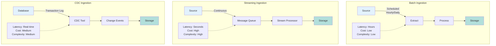

# Data Ingestion

> "Data freshness is just trust, measured in minutes."

> Getting data from source systems into your platform reliably and efficiently.

## Overview

Ingestion is the foundation of your data platform. Get it wrong, and everything downstream suffers. This section provides deep, opinionated guidance on building reliable, cost-effective ingestion systems.

## Decision Framework

Before choosing an ingestion pattern, answer these questions:

1. **Freshness requirement**: Real-time (< 1 min), near real-time (1-15 min), or batch (15+ min)?
2. **Volume**: How many records/second? How many GB/day?
3. **Source type**: Database, API, files, event stream?
4. **Change detection**: Do you need to capture updates/deletes, or just new records?
5. **Cost sensitivity**: What's your budget per GB ingested?

## Key Topics

### [Batch vs Streaming](batch-vs-streaming.md)
When to use batch, streaming, or CDC patterns.

**Learn about:**
- Batch ingestion patterns
- Streaming ingestion architecture
- Change Data Capture (CDC)
- Cost vs freshness trade-offs
- Tool selection guide

### [Change Data Capture (CDC)](cdc.md)
Capturing database changes in real-time.

**Learn about:**
- Log-based CDC
- Trigger-based CDC
- Query-based CDC
- CDC tools (Debezium, Datastream)
- Current state patterns

### [Push vs Pull](push-vs-pull.md)
Source-initiated vs platform-initiated ingestion.

**Learn about:**
- Push architecture (webhooks, APIs)
- Pull architecture (scheduled queries)
- When to use each
- Implementation patterns
- Error handling

### [Strategic Guidelines & Future Thinking](strategic-guidelines.md)
Strategic approaches to building ingestion systems that scale and evolve.

**Learn about:**
- Contracts before pipelines
- Paved paths over pipeline sprawl
- Freshness as first-class SLO
- Cost-aware ingestion design
- Lineage and observability
- Legacy migration strategies
- Domain autonomy patterns
- Future-proofing for AI-assisted ingestion

## Ingestion Patterns

**Batch, streaming, and CDC ingestion patterns with trade-offs.**

### Batch Ingestion

**When to use:**
- Historical loads, backfills
- Large volumes (> 100 GB per run)
- No real-time requirement
- Source systems that don't support streaming

**Characteristics:**
- Scheduled execution (hourly, daily)
- Full or incremental extracts
- Higher latency (minutes to hours)
- Lower cost per GB
- Easier to debug and reprocess

### Streaming Ingestion

**When to use:**
- Real-time analytics requirements
- Event-driven architectures
- Low-latency use cases (fraud detection, recommendations)
- High-volume, continuous data

**Characteristics:**
- Continuous processing
- Low latency (seconds to minutes)
- Higher cost per GB (3-5x batch)
- More complex failure handling
- Requires message queue/bus

### Change Data Capture (CDC)

**When to use:**
- Database replication
- Maintaining current state tables
- Audit trails
- Real-time synchronization

**Characteristics:**
- Captures inserts, updates, deletes
- Maintains transaction consistency
- Lower overhead than full extracts
- Requires source database support (WAL, binlog)

## Cost vs Freshness Trade-offs

!!! warning "Cost Consideration"
    Every 10x reduction in latency costs 3-5x more.

| Latency | Pattern | Cost per GB | Use Case |
|---------|---------|-------------|----------|
| < 1 min | Streaming | $0.10-0.50 | Real-time dashboards, fraud |
| 1-15 min | Micro-batch | $0.05-0.15 | Near real-time analytics |
| 15 min - 1 hr | Batch (frequent) | $0.02-0.05 | Hourly reports |
| 1-24 hrs | Batch (daily) | $0.01-0.02 | Daily ETL, data warehouse |
| > 24 hrs | Batch (weekly) | $0.005-0.01 | Historical analysis |

**Optimization strategy:**
1. Start with the slowest acceptable latency
2. Measure actual requirements (not perceived)
3. Optimize only when latency becomes a bottleneck
4. Use tiered approach: streaming for critical, batch for rest

## Best Practices

### Idempotency
Same data ingested multiple times = same result.

### Checkpointing
Track progress to enable resume on failure.

### Backpressure
Handle source unavailability gracefully.

### Schema Validation
Validate at ingestion boundary.

### Metadata Capture
Record source, timestamp, version.

## Related Topics

- **[Data Architecture](../data-architecture/index.md)** - How to store ingested data
- **[Data Quality](../data-quality/index.md)** - Ensuring data reliability
- **[Data Engineering](../data-engineering/index.md)** - Platform fundamentals

---

**Next**: [Batch vs Streaming →](batch-vs-streaming.md)

