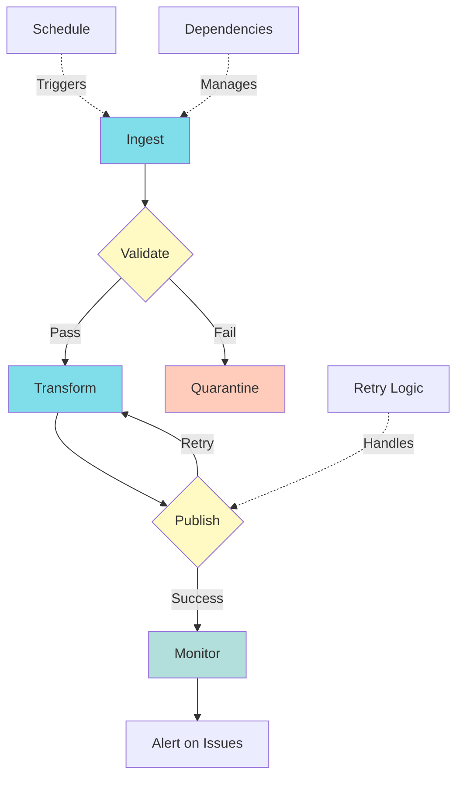

# Data Orchestration

> "Most data outages are just bad communication bugs."

> Scheduling, coordinating, and managing data pipelines.

## Overview

**Workflow orchestration managing dependencies and retries.**

Data orchestration is about coordinating multiple data pipelines, managing dependencies, handling failures, and ensuring data flows reliably through your platform.

## Key Topics

### [Airflow](airflow.md)
Apache Airflow for workflow orchestration.

**Learn about:**
- Airflow concepts (DAGs, tasks, operators)
- DAG design patterns
- Best practices
- Monitoring and troubleshooting

### [dbt](dbt.md)
Data Build Tool for SQL-based transformations.

**Learn about:**
- dbt concepts (models, tests, macros)
- Project structure
- Testing framework
- Documentation generation

## Orchestration Tools

### Apache Airflow

**Best for:** Complex workflows, Python-based

**Pros:**
- ✅ Mature, widely adopted
- ✅ Rich ecosystem
- ✅ Flexible (Python-based)
- ✅ Good UI and monitoring

**Cons:**
- ❌ Requires operations
- ❌ Can be complex
- ❌ Resource-intensive

### dbt

**Best for:** SQL-based transformations, analytics engineering

**Pros:**
- ✅ SQL-based (accessible)
- ✅ Great testing framework
- ✅ Documentation generation
- ✅ Version control friendly

**Cons:**
- ❌ SQL-only
- ❌ Requires orchestration (Airflow, etc.)

### Prefect / Dagster

**Best for:** Modern Python orchestration

**Pros:**
- ✅ Better developer experience
- ✅ Modern architecture
- ✅ Good testing support

**Cons:**
- ❌ Less mature than Airflow
- ❌ Smaller ecosystem

## Related Topics

- **[Data Processing](../data-processing/index.md)** - What to orchestrate
- **[Data Quality](../data-quality/index.md)** - Quality checks in pipelines

---

**Next**: [Airflow →](airflow.md)

