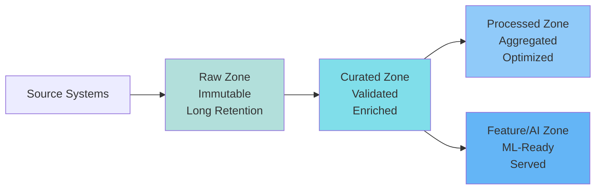

# Next-Gen Data Platform Strategy & Future Direction

> "The biggest opportunity for managers isn't better data — it's making data problems understandable."

This section provides strategic guidance for platform leaders, directors, and architects on where data platforms are heading and how to position your organization for the future.

## Overview

Modern data platforms are evolving from passive infrastructure to **agentic systems** that actively manage data quality, optimize costs, and enable domain autonomy. This evolution requires new thinking about platform architecture, operating models, and organizational structure.

## Key Topics

### [Agentic Data Platforms and Data Zones](platform-strategy-and-future-direction.md#agentic-data-platforms-and-data-zones)
Understanding how platforms become self-managing and how data zones enable scale.

### [Platform Maturity Evolution](platform-strategy-and-future-direction.md#platform-maturity-evolution)
How platforms evolve from manual to automated to agentic.

### [Organizational Implications](platform-strategy-and-future-direction.md#organizational-implications)
What agentic platforms mean for teams, roles, and operating models.

---

## Agentic Data Platforms and Data Zones

### What "Agentic" Means

**Agentic platforms** are data platforms that can:
- **Detect and respond** to issues autonomously
- **Optimize themselves** based on usage patterns
- **Learn from failures** and prevent recurrence
- **Enable domain teams** without constant platform team intervention

This is different from **passive platforms** that require manual intervention for every issue, optimization, or change.

!!! tip "For Directors"
    Agentic platforms reduce "keep the lights on" (KTLO) work by 60-80%, allowing platform teams to focus on strategic capabilities rather than operational firefighting.

### How Agentic Platforms Differ

**Traditional (Passive) Platforms:**
- Manual pipeline creation
- Reactive issue detection
- Human-driven optimization
- Central team bottleneck
- High operational burden

**Agentic Platforms:**
- Self-serve pipeline generation
- Proactive issue detection and resolution
- Automated optimization
- Domain autonomy with guardrails
- Low operational burden

**Real-world example:**

A payment events pipeline starts experiencing increased latency. In a passive platform:
- Day 1: Users report slow dashboards
- Day 2: Platform team investigates
- Day 3: Root cause identified (partition skew)
- Day 4: Manual fix applied
- **Total impact**: 3 days of degraded service

In an agentic platform:
- Hour 1: System detects latency increase
- Hour 2: Automatic analysis identifies partition skew
- Hour 3: System applies fix (repartitioning)
- Hour 4: Verification and alert to team
- **Total impact**: 4 hours, minimal user impact

### Autonomy, Automation, and Feedback Loops

**Three pillars of agentic platforms:**

1. **Autonomy** - Systems make decisions within defined boundaries
2. **Automation** - Repetitive tasks handled automatically
3. **Feedback Loops** - Systems learn and improve from outcomes

**Feedback loop example:**

```
Pipeline Failure
    ↓
Root Cause Analysis (automated)
    ↓
Pattern Detection (learned)
    ↓
Preventive Action (autonomous)
    ↓
Success Validation
    ↓
Pattern Refinement (learning)
```

**Impact:**
- **MTTR**: Reduced from hours to minutes
- **Prevention**: 70-80% of issues prevented before they occur
- **Learning**: System gets better over time

### Data Zones: Ownership and Governance

**Data Zones** are logical boundaries that organize data by:
- **Ownership** - Who is responsible
- **Purpose** - What it's used for
- **Governance** - What rules apply
- **Lifecycle** - How it evolves

**Four core zones:**

#### 1. Raw Zone

**Purpose**: Preserve source data exactly as received

**Characteristics:**
- Immutable (append-only)
- Long retention (7 years)
- Schema-on-read
- Minimal transformation

**Ownership**: Platform team (infrastructure), Source team (data quality)

**Governance**: Contracts, schema validation, retention policies

#### 2. Curated Zone

**Purpose**: Cleaned, validated, enriched data ready for analysis

**Characteristics:**
- Schema-on-write
- Quality checks applied
- Enriched with reference data
- Optimized for queries

**Ownership**: Domain teams (business logic), Platform team (infrastructure)

**Governance**: Quality SLAs, freshness requirements, access control

#### 3. Processed Zone

**Purpose**: Aggregated, transformed data for specific use cases

**Characteristics:**
- Pre-computed aggregations
- Denormalized structures
- Optimized for specific queries
- Shorter retention

**Ownership**: Consumer teams (analytics, ML)

**Governance**: Usage-based optimization, cost attribution

#### 4. Feature / AI Zone

**Purpose**: Data prepared for ML and AI workloads

**Characteristics:**
- Feature stores
- Point-in-time correctness
- Low-latency serving
- Versioned features

**Ownership**: ML teams, Platform team (infrastructure)

**Governance**: Feature contracts, model lineage, serving SLAs

**Zone flow:**



**Data zones clarify ownership and governance.**

### Domain Ownership at Scale

**The challenge:**

As organizations grow, centralized data teams become bottlenecks. Every new pipeline requires platform team involvement, creating:
- 4-6 week wait times
- Shadow systems
- Inconsistent patterns
- High operational burden

**The solution: Domain ownership with guardrails**

**Platform team provides:**
- Infrastructure (Kafka, storage, compute)
- Standard patterns (paved paths)
- Self-serve tooling
- Governance framework

**Domain teams own:**
- Business logic
- Transformations
- Data quality
- Cost optimization

**Guardrails ensure:**
- Contracts enforced (schema, SLAs)
- Cost attribution (showback)
- Quality standards (automated)
- Security policies (automated)

**Real-world example:**

A 500-engineer company with centralized data team:
- **Before**: 4-week wait for new pipelines, 200+ pipelines, 3 different patterns
- **After**: Self-serve platform, 2-hour onboarding, 90%+ standard patterns

**Impact:**
- **Velocity**: 10x faster pipeline creation
- **Consistency**: 90%+ use standard patterns
- **Scale**: Platform team doesn't bottleneck
- **Ownership**: Domains accountable for their data

!!! success "For Managers"
    Domain ownership with guardrails enables teams to move fast while maintaining platform consistency and governance.

!!! tip "For Directors"
    Domain ownership is the only sustainable model at scale. Centralized teams become bottlenecks beyond 50-100 engineers.

### Concrete Examples

#### Self-Healing Pipelines

**Problem**: Pipeline fails due to transient network issue.

**Traditional approach**: Alert fires, engineer investigates, manually restarts.

**Agentic approach**: 
- System detects failure
- Analyzes error (network timeout)
- Waits for backoff period
- Automatically retries
- Escalates only if retries fail

**Impact**: 80% of transient failures resolved automatically.

#### Drift Detection

**Problem**: Source schema changes break downstream.

**Traditional approach**: Downstream breaks, users report, investigation, fix.

**Agentic approach**:
- System monitors schema continuously
- Detects drift immediately
- Validates against contract
- Rejects if breaking change
- Alerts owner for review
- Prevents bad data from entering platform

**Impact**: 99% reduction in schema drift incidents.

#### Domain-Owned Data Products

**Problem**: Analytics team needs user behavior data.

**Traditional approach**: Request to platform team, 4-week wait, manual pipeline creation.

**Agentic approach**:
- Analytics team uses self-serve tool
- System generates pipeline from contract
- Sets up monitoring automatically
- Provisions resources
- Pipeline live in 2 hours

**Impact**: 10x faster time to value.

---

## Platform Maturity Evolution

### Stage 1: Manual

**Characteristics:**
- Manual pipeline creation
- Reactive issue detection
- Human-driven optimization
- High operational burden

**KTLO**: 80% of team time

### Stage 2: Automated

**Characteristics:**
- Self-serve pipeline creation
- Automated monitoring and alerting
- Scripted optimizations
- Medium operational burden

**KTLO**: 40% of team time

### Stage 3: Agentic

**Characteristics:**
- Autonomous pipeline management
- Self-healing systems
- Self-optimizing infrastructure
- Low operational burden

**KTLO**: 10-20% of team time

**Evolution path:**

```
Manual → Automated → Agentic
  ↓         ↓          ↓
High      Medium      Low
KTLO      KTLO        KTLO
```

!!! tip "For Directors"
    Agentic platforms free 60-80% of platform team time for strategic work, not operational firefighting.

---

## Organizational Implications

### For Platform Teams

**Shift from:**
- Building pipelines → Building platforms
- Manual operations → Automated systems
- Reactive support → Proactive capabilities

**New focus:**
- Self-serve tooling
- Autonomous systems
- Domain enablement
- Strategic capabilities

### For Domain Teams

**Gain:**
- Self-serve capabilities
- Faster time to value
- Ownership and autonomy
- Better tooling

**Responsibility:**
- Data quality
- Cost optimization
- Business logic
- Compliance

### For Leadership

**Metrics to track:**
- Time to value (target: < 1 day)
- Self-serve adoption (target: 80%+)
- KTLO reduction (target: 60%+)
- Platform reliability (target: 99.9%+)

**Investment areas:**
- Self-serve tooling
- Automation infrastructure
- Domain enablement
- Observability and lineage

---

## Related Topics

- **[Future Trends](reference/future-trends.md)** - Emerging technologies and patterns, including agentic platforms
- **[Platform & Operating Model](data-engineering/platform-operating-model.md)** - Current operating models
- **[Leadership View](reference/leadership-view.md)** - Measuring platform success
- **[Strategic Guidelines](data-ingestion/strategic-guidelines.md)** - Ingestion strategies
- **[Ingestion Architecture](data-architecture/ingestion-architecture.md)** - Technical implementation of agentic controls

---

**Next**: [Future Trends →](reference/future-trends.md)

