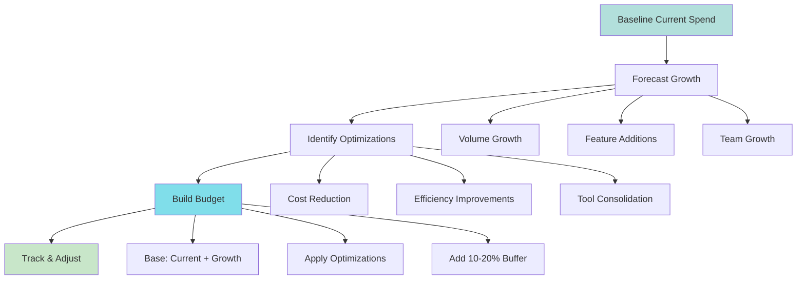
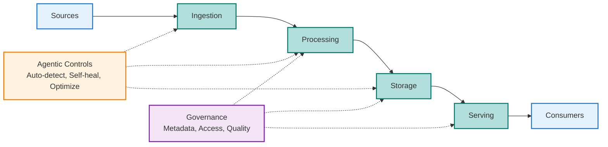

# Leadership View

> "The biggest opportunity for managers isn't better data — it's making data problems understandable."

This page is about **outcomes, not tools**. Platform strategy is about **predictability and scale**. Here's how leaders reason about data platforms.

!!! tip "For Directors"
    This page provides frameworks for strategic decision-making, not implementation details.

## What You'll Find Here

| Section | Audience | Purpose |
|---------|----------|---------|
| **Leadership Metrics** | Managers, Directors | What to measure beyond uptime |
| **Team Scaling** | Managers, Directors | How teams evolve as organizations grow |
| **Platform Maturity** | Directors, Architects | Evaluating architectural maturity |
| **Strategic Decisions** | Directors, Managers | Build vs Buy, Central vs Decentralized |
| **Budgeting & Cost** | Directors, Finance | Cost predictability and ROI |
| **Common Pitfalls** | All Leaders | Mistakes to avoid and how to prevent them |
| **Platform Diagram** | All Leaders | Conceptual view of agentic platform |

---

## Leadership Metrics: What to Measure

**Measure what matters for platform success, not just what's easy to track.**

| Category | Key Metrics | Target | Why It Matters |
|----------|-------------|--------|----------------|
| **Platform Health** | Uptime | 99.9% | Unreliable platform = teams won't trust it |
| | Pipeline success rate | > 99% | Failures create downstream impact |
| | MTTR (critical pipelines) | < 1 hour | Speed of recovery affects business |
| | Ingestion latency (p95) | Meet SLA | Slow platform = poor developer experience |
| **Adoption** | % data sources on platform | 80%+ (12 months) | Low adoption = platform isn't delivering value |
| | Self-serve adoption | 70%+ | High self-serve = platform enables, doesn't block |
| | Active users (MoM growth) | 20%+ (early) | Growth indicates value |
| **Developer Experience** | Time to first ingestion | < 1 day | Fast onboarding = faster value |
| | Time to production | < 1 week | Speed enables business agility |
| | Developer NPS | 50+ | Satisfaction predicts adoption |
| | Support tickets per 100 pipelines | < 5 | Fewer tickets = better self-serve |
| **Cost** | Cost per GB ingested | Decreasing trend | Uncontrolled costs = unsustainable |
| | Cost growth rate | < 20% YoY | Predictable growth enables planning |
| | Cost attribution coverage | 100% | Visibility enables optimization |
| **Business Impact** | SLA compliance rate | > 99% | Reliability enables business |
| | Data freshness (SLA) | > 95% | Fresh data enables real-time decisions |
| | Downstream consumers | Growing | More consumers = more value |

!!! success "For Managers"
    Focus on **adoption** and **developer experience** first. These predict long-term platform success.

!!! tip "For Directors"
    Track **cost predictability** and **business impact**. These determine platform sustainability.

---

## How to Scale Data Platform Teams

**Teams evolve as organizations grow. Structure follows scale.**

| Team Size | Structure | Roles | Focus | Timeline |
|-----------|-----------|-------|-------|----------|
| **Small (< 10 engineers)** | Generalists | 2-3 platform engineers 1 part-time SRE | Get platform working Establish patterns | 0-12 months |
| **Medium (10-50 engineers)** | Some specialization | 5-10 platform engineers 1-2 SRE 1 PM | Scale platform Improve self-serve Optimize costs | 12-24 months |
| **Large (50+ engineers)** | Specialized teams | 15-30 platform engineers 3-5 SRE 2-3 PM Cost optimization team | Platform maturity Advanced capabilities Cost efficiency | 24+ months |

**Hiring strategy by stage:**

| Stage | Hire Profile | Skills | Experience |
|-------|--------------|--------|------------|
| **Early (0-10)** | Senior generalists | Platform engineering, data engineering, operations | 5+ years, worked at scale |
| **Growth (10-50)** | Mix of generalists + specialists | Platform engineering, specific domains | 3-7 years, domain expertise |
| **Mature (50+)** | Specialists + leaders | Deep expertise, leadership | 5+ years, leadership experience |

!!! warning "For Managers"
    Don't hire specialists too early. Generalists are more valuable when patterns aren't established.

!!! success "For Directors"
    Team structure should match organizational scale. Over-structuring early creates overhead.

---

## Platform Architecture Maturity Model

**Evaluate maturity across dimensions, not just features.**

| Level | Name | Characteristics | Indicators | KTLO |
|-------|------|-----------------|-------------|------|
| **1** | Ad-Hoc | Manual pipeline creation No standard patterns Limited observability | Everything is custom High support burden | 80% |
| **2** | Standardized | Common patterns documented Some self-serve capabilities Basic monitoring | Some standards Still manual for many things | 60% |
| **3** | Self-Serve Platform | Most tasks self-serve Clear contracts and SLAs Cost attribution | 70%+ self-serve Low support burden Teams move fast | 30% |
| **4** | Agentic Platform | Full self-serve Predictive quality Automated optimization | Minimal platform team involvement High satisfaction Innovation | 10-20% |

**Maturity assessment by dimension:**

| Dimension | Level 1 | Level 2 | Level 3 | Level 4 |
|-----------|---------|---------|---------|---------|
| **Ingestion** | Manual, custom | Some templates | Self-serve, standardized | Fully automated |
| **Transformation** | Ad-hoc scripts | Some frameworks | Standard frameworks, self-serve | Optimized, automated |
| **Storage** | Ad-hoc, no standards | Some standards | Tiered, lifecycle policies | Optimized, predictive |
| **Quality** | Manual checks | Some automated | Comprehensive, automated | Predictive, self-healing |
| **Governance** | Ad-hoc | Basic policies | Contracts, automated | Federated, self-service |
| **Observability** | Limited | Basic metrics | Comprehensive | Predictive |
| **Cost** | Unattributed | Some attribution | Full attribution, optimization | Automated optimization |

**Scoring**: Rate each dimension 1-4, average = maturity level.

**Roadmap to maturity:**

- **Level 1 → 2** (6-12 months): Document patterns, create templates, basic monitoring
- **Level 2 → 3** (12-18 months): Build self-serve, implement contracts, cost attribution
- **Level 3 → 4** (18-24 months): Advanced automation, predictive capabilities, self-healing

!!! tip "For Directors"
    Most organizations operate at Level 2-3. Level 4 (agentic) is the future state.

!!! success "For Data Engineers"
    Maturity isn't about features—it's about reducing operational burden and enabling teams.

---

## Strategic Decision Framework

**Build vs Buy: When to invest in custom solutions.**

| Factor | Build | Buy | Hybrid (Recommended) |
|--------|-------|-----|---------------------|
| **Requirements** | Unique, no tool fits | Standard, tools exist | Standard capabilities: buy Unique: build |
| **Time to market** | Slower (months) | Faster (weeks) | Balance speed and differentiation |
| **Resources** | Need engineering capacity | Limited resources | Buy standard, build differentiating |
| **Competitive advantage** | Platform is differentiator | Not a differentiator | Build what differentiates |
| **Cost** | Higher upfront, lower ongoing | Lower upfront, higher ongoing | Optimize total cost of ownership |
| **Customization** | Full control | Limited | Customize bought tools as needed |

**Decision rule**: Build when it's a **competitive advantage** or **unique requirement**. Buy when it's **standard** and you need **speed**.

**Central vs Decentralized:**

| Approach | When to Use | Structure |
|---------|-------------|-----------|
| **Central** | Strong governance needed Limited domain expertise Large org (1000+ engineers) | Central platform team controls everything |
| **Decentralized** | Need speed and autonomy Strong domain expertise Small org (< 100 engineers) | Domain teams own end-to-end |
| **Hybrid (Recommended)** | Most organizations | Central platform (infrastructure, standards) Domain teams (business logic, transformations) Shared governance (framework, not control) |

!!! success "For Directors"
    Hybrid approach balances speed and consistency. Most successful platforms use this model.

---

## Budgeting & Cost Predictability

**Cost structure and planning process for predictable budgets.**

**Cost components:**

| Component | % of Budget | Includes |
|-----------|-------------|----------|
| **Infrastructure** | 40-60% | Compute, storage, network |
| **Tools & Licenses** | 10-20% | SaaS tools, software licenses |
| **Operations** | 10-15% | Platform team salaries, on-call |
| **Development** | 10-15% | New features, optimizations |

**Budget planning flow:**

**Budget planning process:**

1. **Baseline current spend** - Track all costs, categorize by team/project/source
2. **Forecast growth** - Volume, features, team growth
3. **Identify optimizations** - Cost reduction, efficiency, consolidation
4. **Build budget** - Base + growth - optimizations + buffer (10-20%)
5. **Track and adjust** - Monthly reviews, quarterly forecasts

**ROI framework:**

**Decision rule**: If payback < 12 months and ROI > 100%, do it.

**Example calculation:**
- Engineering cost: $30,000 (200 hours × $150/hour)
- Time saved per pipeline: 8 hours (manual → self-serve)
- Pipelines per month: 10
- Monthly savings: $12,000 (8 × 10 × $150)
- Annual savings: $144,000
- ROI: 380%
- Payback period: 2.5 months

!!! tip "For Directors"
    Budget predictability is more important than absolute cost. Finance needs forecasts, not surprises.

!!! success "For Managers"
    Track cost attribution from day one. Visibility enables optimization.

---

## Common Pitfalls & Mitigations

**Learn from common mistakes to avoid costly errors.**

| Pitfall | Symptoms | Impact | Mitigation |
|---------|-----------|--------|------------|
| **Over-Engineering** | Complex solutions for simple problems Long development cycles Low adoption | Wasted resources Slow time to value | Start simple, add complexity only when needed |
| **Ignoring Costs** | Costs growing unchecked No cost attribution Budget surprises | Unsustainable platform Loss of trust | Track costs from day one, optimize continuously |
| **Poor Developer Experience** | Low adoption High support burden Long onboarding times | Platform doesn't deliver value Team frustration | Invest in self-serve, documentation, tooling |
| **No Metrics** | Can't measure success No data-driven decisions Unclear priorities | Flying blind Poor decisions | Define metrics early, track religiously |
| **Chasing Trends** | Adopting every new tool Constant re-architecture No stability | Wasted effort Technical debt | Adopt when it solves real problems, not because it's new |
| **Central Bottleneck** | 4-6 week wait times Platform team overwhelmed Shadow systems | Slow velocity Inconsistent patterns | Enable domain autonomy with guardrails |
| **No Contracts** | Schema drift breaking downstream Unclear ownership Quality issues | Broken pipelines Trust issues | Implement contracts before pipelines |

!!! warning "For Directors"
    These pitfalls compound over time. Address them early, not when they become crises.

!!! success "For Managers"
    Most pitfalls stem from lack of measurement or poor developer experience. Focus there first.

---

## Conceptual Platform Diagram

**Agentic platform with governance and controls layered on core infrastructure.**

**Platform layers:**

- **Platform Core** - Ingestion → Processing → Storage → Serving (main data flow)
- **Agentic Controls** - Autonomous systems that detect, respond, and optimize
- **Governance** - Metadata, access control, quality, observability

**Key insight**: Agentic controls and governance are **layered on** the platform core, not separate systems.

---

## Related Topics

- **[Platform Strategy](../platform-strategy-and-future-direction.md)** - Next-gen platform direction and agentic systems
- **[Platform & Operating Model](../data-engineering/platform-operating-model.md)** - Current operating models
- **[Cost Efficiency](../data-engineering/cost-efficiency.md)** - Practical cost optimization strategies
- **[Strategic Guidelines](../data-ingestion/strategic-guidelines.md)** - Ingestion strategies for scale

---

**Remember**: Building a data platform is a journey, not a destination. Start simple, measure everything, iterate based on data.
